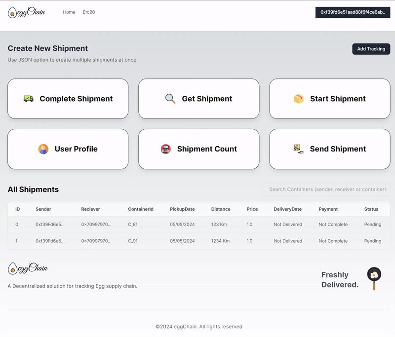

    
      

<h1 align='center'>eggChain Decentralized App</h1>

  

 

EggChain is a Decentralized Application based on `Etherium` Blockchain to track egg shipments from the place of production to the final destination of sale.

Every transaction is public to the consumer, to view the entire history of every single trasaction in the `supply chain`.

## Features
- [x] Creation of Shipments, one at a time or multiple entries at a time using `JSON` file format .
- [x] Starting the Shipment from the Sender to Receiver.
- [x] Receive and `Pay` in `Ether` for shipments at Receiver's End
- [x] Wallet based `authentication` to ensure, only the owner of a shipment can perform operations on it.
- [x] Looking up `Current Shipment Status & Details` By ID.

