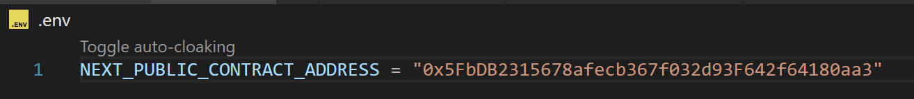

<div align="center" style="display:flex; align-items: center; justify: center; text-decoration: none ">
    <a href="https://github.com/Abhinav-ark/eggChain_DApp/blob/main/LICENSE" target="_blank" rel="noreferrer">
      
    </a>
    <a href="https://github.com/Abhinav-ark/eggChain_DApp" target="_blank" rel="noreferrer">
      
    </a>  
</div>

<h1 align='center'>eggChain Decentralized App</h1>

<div align='center'>
  
</div>

<br>

<!-- <h2 align='center'>About</h2> -->

EggChain is a Decentralized Application based on `Ethereum` Blockchain to track egg shipments from the place of production to the final destination of sale.

Every transaction is public to the consumer, to view the entire history of every single trasaction in the `supply chain`.

<h2 align='center'>Tech Stack</h2>
<div align='center'>
    
    
    
    
    
    
    
    
</div>

## Features
- [x] Creation of Shipments, one at a time or multiple entries at a time using `JSON` file format.
- [x] Starting the Shipment from the Sender to Receiver.
- [x] Receive and `Pay` in `Ether` for shipments at Receiver's End
- [x] Wallet based `authentication` to ensure, only the owner of a shipment can perform operations on it.
- [x] Looking up `Current Shipment Status & Details` By ID.
- [x] `Search for shipments` based on containerId, sender address and receiver address.

<br>

# Interacting with the Decentralized Application

<div align="center">
    
</div>

<br>

This is the Home dashboard of the eggChain DApp which offers multiple services: **Create Shipment, Start Shipment, Complete Shipment, Send Shipment, All Shipment, Get Shipment, Profile**
<br>

## Creating A Shipment

1. Click on `Add Tracking` to open the Create Shipment Dialog Box, Fill the Details and Click on `Create Shipment` .

<br>
<div align="center">
    
</div>

<br>
2. Pay the Gas Fees to proceed with the Transaction 
<br>
<br>
<div align="center">
    
</div>

<br>

3. You will get a `Transaction Successful` Alert if the Transaction was successful.

<br>
<div align="center">
    
</div>

<br>

4. You can Alternatively Create Multiple Shipments by uploading a JSON file in the prescribed format, Click on `Use JSON File` Button, In the `Create Shipment` Dialog Box. 

<br>
<div align="center">
    
</div>

<br>
<div align="center">
    
</div>

<br>
This the The Updated Transactions Table After Creating the Shipments.
<br>
<br>
<div align="center">
    
</div>

<br>

## Starting A Shipment
Enter the **receiver wallet address, shipmentId**, start the shipment and pay the gas fee. You should see the status of the Shipment become **IN_TRANSIT** in the Shipments Table.
<div align="center">
    
</div>

<br>

## Completing A Shipment
Enter the **receiver wallet address, shipmentId**, start the shipment and pay the (gas fee + shipment amount). You should see the status of the Shipment become **DELIVERED** and the Delivery date updated to the current date in the Shipments Table.
<div align="center">
    
</div>

<br>

## Sending A Received Shipment
1. Change your `Metamask account` to an account which is a receiver of any delivered shipment. Here I am changing it to Account 4.
<div align="center">
    
</div>

<br>

2. Enter the receiver of the new shipment, the container you want to transfer, pickup date, distance and price in Ether. Click on `Send Shipment` and pay the gas fee to proceed.
<div align="center">
    
</div>

<br>

## Searching The History Of A Container
The All Shipments Table section of the dashboard has a search that helps to search shipments by sender address, receiver address and containerId which plays an instrumental role is seeing all shipments sent by a user, seeing all shipments received by a user and the whole supply chain life cycle of a container shipment.
<div align="center">
    
</div>

<br>

## Get Details Of A Specific Shipment
Enter the shipmentId of a shipment to see data regarding it's current status. 
<div align="center">
    
</div>

<br>

## Total Shipments On the Supply Chain Network
You can see the total number of Shipments that happened on the supply chain till now.
<div align="center">
    
</div>

<br>

## Profile (If logged in using wallet)
You can the the user's wallet balance and total no. of shipment made by the user till date. 
<div align="center">
    
</div>

# How to Run the DApp
- Either clone the repository (or) download the Source Code from the latest release.
- Make sure you have [`nodeJS`](https://nodejs.org/en/download) installed on your Computer (Node 20 LTS is recommended).
- Run this command from the parent directory, to install all dependencies.
```bash
> npm install --force
```
- Run a local hardhat node.
```bash
> npx hardhat node
```
- A `JSON RPC Server` is started in your localhost:8545 and you get 20 Accounts with 10000 Eth. in each account.

<div align="center">
    
</div>

- Create a new terminal instance and `deploy the smart contract` to the local network.
```bash
> npx hardhat ignition deploy ignition/modules/Tracking.js --network localhost
```
<div align="center">
    
</div>

> [!IMPORTANT]
> Run `npx hardhat clean` and `npx hardhat compile` to clean the artifacts of the previous smart contract and compile the new one, whenever you modify the smart contract.

- Create a .env file to enter the contract address you got in the previous step as an Environmental Variable.
<div align="center">
    
</div>

- Start a local NextJS development server.
```bash
> npm run dev
```

- You can access the DApp from `http://localhost:3000` in your `Google Chrome` Browser.

- Install `Metamask wallet` extension for Google Chrome.

- Login to your Metamask Wallet

- Add and connect to the local Ethereum network. `Settings > Networks > Add A Network > Add a network manually`
<div align="center">
    
</div>

- Add any accounts to the Metamask Wallet from the 20 you got after running the hardhat node. Goto `Add account > Import Account`. Enter the private key of the account you want to import and click on Import.

- You can interact with the DApp now after logging in to an Account on the network.

> [!WARNING]
> If you transactions keep failing and you get a `MetaMask - RPC Error: Internal JSON-RPC error` on the console, It is most likely due to an Issue with Metamask. In that Case goto `Settings > Advanced` and click on `Clear activity tab data` and try again.

<br>

# Contributing
Refer to The [Code of Conduct](https://github.com/Abhinav-ark/eggChain_DApp/blob/main/CODE_OF_CONDUCT.md) before making a pull request to the repository, posting on the discussions section or involing in any public activity related to this repository.

# Licensing
All code in this repository is Licensed Under `MIT License`, and is freely available for anyone to use or make changes.

# Security Policy
Refer [SECURITY.md](https://github.com/Abhinav-ark/eggChain_DApp/blob/main/SECURITY.md) for Security Policy.
